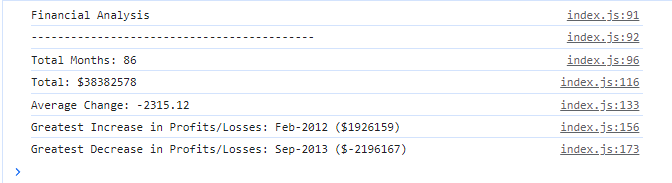

# Console Finances - Week 4 Challenge

## Description

The aim of this project was to create a program that will analyse a company's financial records. I undertook a lot of my own research during this challenge, and the information that I learned has progressed my understanding of JavaScript, as well as my ability to research, significantly. 

## Installation

Application deploys at live URL
Link: https://kaiwright.github.io/Console-finances/

## Usage

The application deploys from the link above. The console displays the number of months with available data, as well as the net total, average of the changes, and the greatest increase/decrease in profits/losses over this time. 

The result prints to the console, as shown in the image below.

## License

MIT License

## Credits

I completed this work on my own, with the use of the resources listed below. 

### Resources
* Flatten nested array: https://dev.to/sanchithasr/understanding-nested-arrays-2hf7
* Filter to only numbers: https://bobbyhadz.com/blog/javascript-filter-array-to-only-numbers
* Finding difference: https://stackoverflow.com/questions/30399123/finding-difference-between-consecutive-numbers-in-an-array-in-javascript
* Calculating sum of an array: https://www.freecodecamp.org/news/how-to-add-numbers-in-javascript-arrays/
* Rounding Numbers: https://codedamn.com/news/javascript/javascript-round-a-number-to-2-decimal-places-with-examples
* Finding the largest number in an array: https://stackoverflow.com/questions/13794225/finding-largest-integer-in-an-array-in-javascript
* Finding an array index with a value: https://www.geeksforgeeks.org/how-to-find-the-array-index-with-a-value-in-javascript/

